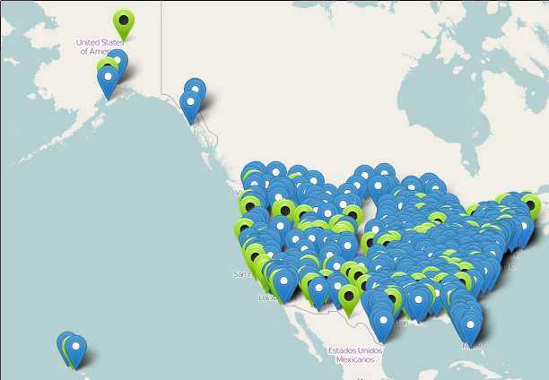

% A list of US-based Natural History Collections
% <small><a href="http://francoismichonneau.net">François Michonneau</a> / <a
% href="https://twitter/fmic_/"><span style="text-transform: none;">@fmic_</span></a> / <span style="text-transform: none;">iDigBio</span> <br/> Larry Page /  <span style="text-transform: none;">iDigBio</span></small>
% <small>SPNHC -- May 21st, 2015</small>


```{r, echo=FALSE}
knitr::opts_chunk$set(echo=FALSE, results="hide")
```

```{r}
suppressPackageStartupMessages(library(dplyr))
suppressPackageStartupMessages(library(ggplot2))
suppressPackageStartupMessages(library(wesanderson))

wespal <- wes_palette("Zissou", 5)

biorep <- read.csv(file="biorepositories.csv", stringsAsFactors=FALSE) %>%
  filter(!verified %in% c("D", "X", "N"))


```

-------

### Why this list?

- Needed by <span style="text-transform: none;">iDigBio</span>
- Requested by NSF

-------

### Why this list?

Needed by the community to:

- discover specimens (the dark data)
- improve collaborations
- identify small collections that need special attention

-------

### Goals

- Focus on collections
- Currently active
- Mostly natural history collections

-------

### Where does it come from?

- Index Herbariorum
- GRBio (includes IH)
- List of institutions/collections from various sources
- Institution/collections websites

-------

### Portal demonstration

[iDigBio portal](https://www.idigbio.org/portal/collections)



-------

### How many?

```{r}
n_inst <- length(unique(biorep$Name.of.Institution))
n_coll <- filter(biorep, Name.of.Collection != "MAIN") %>% nrow
n_herb <- sum(grepl("herb", biorep$Name.of.Institution, ignore.case = TRUE) |
                grepl("<IH>$", biorep$Institutional.ID.Acronym))
hist_data <- data.frame(type=c("Collections", "Herbaria"), size=c(n_coll, n_herb))
```

* `r n_coll` collections
* including `r n_herb` (40%) herbaria

```{r, fig.cap='', fig.height=5}
ggplot(hist_data) + geom_bar(aes(x = type, y = size), stat="identity",  fill=wespal[c(1, 3)]) +
  theme_bw() + ylab("Number") + xlab("") + theme(text = element_text(size = 20))
```

---------------

### Comparison with GRBio

```{r, fig.width=10, fig.height=6, fig.cap=''}
suppressPackageStartupMessages(library(VennDiagram))
grid.newpage()
draw.pairwise.venn(area1 = n_coll, area2 = 833+126, # 833 number of US institutions, 126 collections in GRBio as of 2015-05-21
                   cross.area = sum(!is.na(biorep$institutionLSID) &
                                      nzchar(biorep$institutionLSID)),
                   category = c("iDigBio", "GRBio"), fontfamily = rep("sans", 3),
                   cex = rep(2, 3), cat.fontfamily = rep("sans", 2),
                   fill = c("light blue", "pink"), alpha = rep(0.5, 2))
```

------------

### Already in <span style="text-transform: none;">iDigBio</span>

```{r}
n_idig <- sum(nzchar(biorep$participates.iDigBio))
p_idig <- (n_idig/n_coll)*100
```

`r n_idig` collections (`r sprintf("%.0f", p_idig)`%)

------------

### Future

* Seamless transfer of information

   * Common data model with other repositories
   * API access

* Example of community organization

------------

### Questions?

Don't forget to check your institution is listed!
