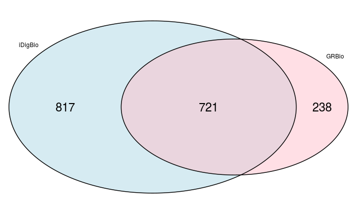

% A list of US-based Natural History Collections
% <small><a href="http://francoismichonneau.net">François Michonneau</a> / <a
% href="https://twitter/fmic_/">@fmic_</a> / iDigBio   Larry Page /  iDigBio</small>
% <small>SPNHC -- May 21st, 2015</small>

-------

### Why this list?

- Needed by iDigBio

-------

### Why this list?

Needed by the community to:

- discover specimens (the dark data)
- improve collaborations
- identify small collections that need special attention

-------

### How we compiled it?

- Index Herbariorum
- GRBio (includes IH)
- List of institutions/collections from various sources
- Institution/collections websites

-------

### Portal demonstration

[iDigBio portal](https://www.idigbio.org/portal/collections)

-------

### How many?

* 903 institutions
* 1538 collections (613, 40% being herbaria)

 

---------------

### Comparison

 

------------

### Already in iDigBio

302 collections (20%)

------------

### Future

* Seamless transfer of information

  - Common data model
  - API access

* Example of community organization

------------
